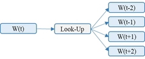
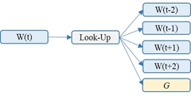
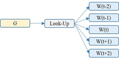

#### **A Literature Embedding Model for Cardiovascular Disease Prediction using Risk Factors, Symptoms, and Genotype Information**
##### Authors: Jihye Moon, Hugo F. Posada-Quintero, and *Ki. H. Chon 
**Corresponding author's address:** ki.chon@uconn.edu, 
**Q&A for codes:** jihye.moon@uconn.edu
(Accepted by Expert System with Application, Aug. 24. 2022)

### Contents

This code is aimed to provide the implementation of 1) **Literature data collection and preprocessing**, and 2) **Literature embedding model training and evaluation**. The pre-trained Literature embedding model aims to identify CVD risk factors and associated information for a given input query. Also, since our Literature Embedding model contains representations for CVD-related words, our Literature model can work as **Feature Selection (FS) and Dimensionality Reduction (DR) models on cohort data** for CVD prediction/classification tasks. The FS and DR applications requires cohort data consisting of variables and the variable's names per subject. The input cohort data must be prepared by the users. We also provide a pipeline for the FS and DR for input cohort data in this guideline.

1. [Introduction](#introduction) 
2. [Code Implementations and Guidelines](#gudelines)
    0. [Demo](#demo)
        1. [Default demo for CodeOcean](#default_demo)
        2. [CVD risk factors, genes, and associated information identifications](#demo1)
        3. [All stepts to build a Literature Embedding Model (Data Collection ~ Model Training)](#demo2) 
    1. [Literature data collection](#collection)
    2. [Literature data preprocessing](#preprocessing)
    3. [Literature embedding model training](#training)
    4. [Literature embedding model evaluation](#evaluation)
    5. [FS and DR applications on cohort data](#applications)
3. [Original Code Implementations of Our Published Paper](#reference)
4. [Results](#results)
5. [GitHub Source](#github)

### 1. Introduction 
Accurate prediction of cardiovascular disease (CVD) requires multifaceted information consisting of not only a patient’s medical history, but genomic data, symptoms, lifestyle, and risk factors which are often not incorporated into a decision-making process as the data are vast, difficult to obtain, and require complex algorithms. **Estimating CVD risk factors is now a significant goal for more accurate CVD prediction and treatment**. 
##### Previous work's limitation
CVD risk factors can be identified from phenotype variables, genetic arrays, text, and image data. Several approaches have been introduced to identify CVD risk factors that are categorized as: (1) cohort-based CVD risk factor identification, and (2) literature-based CVD risk factor identification and information management. Category (1) enables objective validation of the identified risk factors using CVD patient data, but the number of available features is limited, which may limit the identification of new CVD risk factors. Category (2) enables the management of significant risk factors using publicly-available literature data, however, most methods were not validated using CVD patient data. Hence, **it is critical to developing a novel method to collect information on the risk factors, associated symptoms, and mechanisms, but it needs to be objectively validated using CVD patients to be relevant for better clinical diagnosis and treatment management.**
##### Our proposed work
In this paper entitled **A Literature Embedding Model for Cardiovascular Disease Prediction using Risk 
Factors, Symptoms, and Genotype Information** , **we proposed a literature embedding model that trained using literature data freely accessible online.** Our model enables the retrieval of CVD risk factors, associated information, and genes independently from population-based data. Even though our literature model was trained using literature, our model enables selecting accurate CVD-related features from the population-based cohort data as FS and DR models, which involves better CVD prediction. 

### 2. Code Implementation and Guidelines 
This section consists of six subsections: [0. Demo](#demo), [1. Literature data collection](#collection), [2. Literature data preprocessing](#preprocessing), [3. Literature embedding model training](#training), [4. Literature embedding model evaluation](#evaluation), and [5. FS and DR applications on cohort data](#applications). 
Demo will show an overall in our codes, and other five subsections will show details of in code for each purpose.
We prepared five main codes: 1) step1_data_collection.py, 2) step2_data_preprocessing.py, 3) step3_literature_embedding_training.py, 4) step4_CVD_risk_factor_identification.py, and 5) Applications_CVD_prediction.py. We feed different input to each code for each purpose. Details are described below.

#### 2.0. Demo 

The DEMO provides a) **CVD risk factors, genes, and associated information identifications** using pre-trained literature model, b) some results for all steps of **literature data collection, preprocessing, literature embedding model training, and evaluation**. 

##### 2.0.1. Default demo at CodeOcean 

Default demo is operated by following command:
~~~~ {.sourceCode .shell}
./run.sh 
~~~~

**For this CodeOcean capsule, running both a) and b) is default**. However, since the literature data collection process gets error due to 'error 429 too many requests' in CodeOcean environment, we excluded 'step1_data_collection.py' for this CodeOcean environment.

We prepared collected data at DATA_COLLECTION_PATH='../data/demo_files' for 'python -u step2_data_preprocessing.py'.
To include data collection process, run ./run.sh 'all_demo' or 'demo_b' **at your local computer**. As shown in below codes in the ./run.sh, ony step1_data_collection.py is excluded and DATA_COLLECTION_PATH is defined as '../data/demo_files' for this demo.

~~~~ {./run.sh} 
  BASE_PATH='../results/'
  DATA_COLLECTION_PATH='../data/demo_files' ## In 'all_demo' or 'demo_b', it is '../results/demo_b'
  PREPROCESSEING_PATH='../results/demo_b'
  EMBEDDING_NAME='pre_trained_demo'
  EMBEDDING_PATH=$BASE_PATH + $EMBEDDING_NAME
  EPOCH=3
  STEP4_OUTPUT_PATH='../results/CVD_searches'

  ##python -u step1_data_collection.py $QUERY_WORD $NUM_WORD_BASED_DATA $NUM_GENE_BASED_DATA $DATA_COLLECTION_PATH
  python -u step2_data_preprocessing.py $DATA_COLLECTION_PATH $PREPROCESSEING_PATH
  python -u step3_literature_embedding_training.py $PREPROCESSEING_PATH $EPOCH $EMBEDDING_NAME
  python -u step4_CVD_risk_factor_identification.py $EMBEDDING_NAME $STEP4_OUTPUT_PATH
~~~~
##### 2.0.2. Demo-a) CVD risk factors, genes, and associated information identifications 
To run Demo-a, run the following command (at your local computer or CodeOcean): 
~~~~ {.sourceCode .shell}
./run.sh 'demo_a'
~~~~

The command imports our pre-trained literature embedding model at EMBEDDING_PATH='../data/old_model' and captures CVD risk factors and associated information for three queries ('stroke', 'atrial fibrillation, 'ventricular fibrillation).
The input query-related risk factors, associated information, and gene names will be displayed and saved in STEP4_OUTPUT_PATH='../results/demo_a'. 

To put your custom query, refer to [Literature embedding model evaluation](#evaluation)

##### 2.0.3. Demo-b) All stepts to build a Literature Embedding Model (Data Collection ~ Model Training) 
To run Demo-b, run the following command at **your local computer**: 
~~~~ {.sourceCode .shell}
./run.sh 'demo_b'
~~~~
Demo b) provides all steps for **literature data collection**, preprocessing, literature embedding model training & evaluation. Hence, unlike defauls at CodeOcean, this 'demo_b' uses 'step1_data_collection.py' and DATA_COLLECTION_PATH='../results/demo_b' as shown in below codes. 

~~~~ {.sourceCode .shell}
./run.sh 'demo_b' 
  echo 'demo b -- '
  QUERY_WORD='heart' ## you can define query word to collect literature data
  NUM_WORD_BASED_DATA=50000
  NUM_GENE_BASED_DATA=10
  BASE_PATH='../results/'
  DATA_COLLECTION_PATH='../results/demo_b'
  PREPROCESSEING_PATH='../results/demo_b'
  EMBEDDING_NAME='pre_trained_demo' 
  EMBEDDING_PATH='../results/pre_trained_demo'
  EPOCH=2
  STEP4_OUTPUT_PATH='../results/CVD_searches'

  python -u step1_data_collection.py $QUERY_WORD $NUM_WORD_BASED_DATA $NUM_GENE_BASED_DATA $DATA_COLLECTION_PATH
  python -u step2_data_preprocessing.py $DATA_COLLECTION_PATH $PREPROCESSEING_PATH
  python -u step3_literature_embedding_training.py $PREPROCESSEING_PATH $EPOCH $EMBEDDING_NAME
  python -u step4_CVD_risk_factor_identification.py $EMBEDDING_NAME $STEP4_OUTPUT_PATH
~~~~

Demo b) uses the limited number of literature data and epoch for literature embedding model training. To use original or custom setting, refer to [2.1. Literature data collection](#collection), [2.3. Literature embedding model training](#training). This demo generates some data in './results': 
- The collected literature data will be in './results/demo_b/literature_data/*'.
- The pre-processed literature data will be saved in './results/demo_b/preprocessed/*'. 
- The new literature embedding model will be saved into 'results/new_model'

#### 2.1. Literature data collection 
To build Literature embedding model, we collected published literature from PubMed using search keywords consisting of a word (“heart”) and 19,264 of human gene names, then trained our literature embedding model using the collected abstracts. Table shows collected abstracts

~~~~ {.sourceCode .shell}
python -u step1_data_collection.py 'heart' 0 0 '../results/literature_data'
~~~~

*Table 1. An example of collected abstracts*
|
Document type
|
Keyword
|
Example
|
|:---|:---|:---|
|Keyword-based Literature from PubMed|Heart|Waist-to-hip ratio (WHR) is a strong predictor of mortality in patients with heart failure (HF). Left ventricular diastolic filling function has predictable maturational progression, with significant differences in the intraventricular pressure difference between infants from birth to 2 years. | 
|Gene Name-based Literature from PubMed|HMGA1|HMGA1 has been shown to regulate genes involved with systemic inflammatory processes. We hypothesized that HMGA1 is important in the function of mesenchymal stromal cells, which are known to modulate inflammatory responses due to sepsis.| 

#### 2.2. Literature data preprocessing 

~~~~ {.sourceCode .shell}
python -u step2_data_preprocessing.py '../results/demo_b' '../results/demo_b'
~~~~

*Table 2. An example of text preprocessing*
|
Document
|
Gene Name
| Sentence                                                                                                                           |
|:---|:---|:---|
| Original      | HMGA1     | Mesenchymal stromal cells expressing a dominant-negative high mobility group A1 transgene exhibit improved function during sepsis. |
| Pre-processed | #HMGA1    | mesenchymal stromal cells expressing dominant-negative high mobility group a# transgene exhibit improved function sepsis           |

#### 2.3. Literature embedding model training 
The architecture consists of three steps. In order to train 'heart'-related words, we train basic skip-gram structure as shown in Fig.1(a). 

Fig. 1. Skip-gram structure of Word2vec
| (a) step 1| (b) step 2| (c) step 3|
| :---:        |    :---:   |          :---: |
| |||
|Skip-gram structure to predict context words using a center word in the same document|Proposed structure (1) to predict captured document's word contexts with gene name that used as search query |Proposed structure (2) to predict gene-name-associated words in captured document using gene name|

Following command is to train a literature model:

~~~~ {.sourceCode .shell}
python -u step3_literature_embedding_training.py '../results/demo_b' 10 '../results/pre_trained_demo'
~~~~

We can set hyper-parameters in step3_literature_embedding_training.py:
~~~~ {step3_literature_embedding_training.py}
 window_size = 2 #
 min_count = 5 #
 min_size = 2 #
 dimension = 128 #
 num_sampled = 16 #
 batch_size = 256 #
~~~~

Model will be trained using data from 'root_path' while the number of 'epoch'. The pre-trained model will be saved in 'output' using below parameters in step3_literature_embedding_training.py. Epoch should be more than 10 for practical application.
~~~~ {step3_literature_embedding_training.py}
 root_path = '../results/' + sys.argv[1] #
 epoch = int(sys.argv[2])
 output = sys.argv[3]
~~~~

#### 2.4. Literature embedding model evaluation (CVD risk factor searches) 

~~~~ {.sourceCode .shell}
python -u step4_CVD_risk_factor_identification.py 'pre_trained_demo'
~~~~

you can put your own query in step4_CVD_risk_factor_identification.py like below:

~~~~ {.sourceCode .python}
queries = ['stroke', 'atrial fibrillation', 'ventricular fibrillation'] #put your own query in []
~~~~

#### 2.5. FS and DR applications on cohort data 

Our Literature Embedding model is also able to work as FS and DR models for cohort data. We used MESA cohort data consisting of in our manuscript. 

~~~~ {.sourceCode .shell}
Applications_CVD_prediction.py output_path model_path X_path y_path
~~~~

output_path = '../results/CVD_prediction_results' 
model_path = '../data/old_model'
X_path = '../data/MESA_X.csv'
y_path = '../data/MESA_y.csv'

Users are required to prepare their own cohort data to use literature Embedding model as FS or DR tasks. The prepared cohort data are required to have variables and each variable's names per subject.

The format of input cohort data (PATH_X) should be like below:

|

|
heart rate
|
d2
|
...
|
dN-1
|
dN
|
|:---:|:---:|:---:|:---:|:---:|:---:|
| Subject1  | 0.01  | -0.02 | ... | 0.06  | 0.04 |
| Subject2 | -0.09 | -0.02 | ... | 0.04  | 0.00 |
| ...    | ...   | ...   | ... | ...   | ...  |
| SubjectN  | 0.02  | 0.11  | ... | -0.01 | 0.07 |

The format of CVD label per subject should be like below:
|
Subject
|
CVD (Yes=1, no=0)
|
|:---|:---|
| Subject1  | 0  |
| Subject2 | 1 |
| ...    | ...   |
| SubjectN-1   | 1   |
| SubjectN  | 0  |

To preprocess cohort data variable names, use '' in xxx. 
For FS taskes, this model computes 
Our FS computes the 

|

|
heart rate
|
d2
|
...
|
dN-1
|
dN
|
|:---:|:---:|:---:|:---:|:---:|:---:|
| Subject1  | 0.01  | -0.02 | ... | 0.06  | 0.04 |

~~~~ {.sourceCode .shell}
  PREPROCESSEING_PATH='../data/old_processed_literature_data'
  EMBEDDING_NAME='original_setting'
  BASE_PATH='../results/'
  EMBEDDING_PATH=$BASE_PATH + $EMBEDDING_NAME
  EPOCH=10
  STEP4_OUTPUT_PATH='../results/CVD_searches'

  python -u step2_data_preprocessing.py $DATA_COLLECTION_PATH $PREPROCESSEING_PATH
  python -u step3_literature_embedding_training.py $PREPROCESSEING_PATH EPOCH $EMBEDDING_NAME
  python -u step4_CVD_risk_factor_identification.py $EMBEDDING_NAME $STEP4_OUTPUT_PATH
~~~~

### 4. Results 

In our manuscript, we put three queries ('stroke', 'atrial fibllilation', 'ventricular fibllilation') for CVD risk factor identifications. We analyzed whether or not the captured words and genes were correctly identified as risk factors and associated symptoms for the input query words. Our model accurately (average accuracy of >96%) captured associated risk factors, symptoms, and genes for a given input query word. Details are described in our publisehd manuscript. 

We also used our embedding model as FS and DR tasks on cohort data for CVD prediction. Using the selected features and reduced dimensions, our FS and DR method provides better performance with fastest computation time when compared with other popular FS and DR methods - Random Forest, Decision Tree, H2FS, UMAP, and PCA. 

Our model has the potential to facilitate easier collation of multifaceted information for better data mining of vast publicly available data so that efficient and accurate risk factors and symptoms can be identified, which enables better-informed decisions for CVD prediction and treatment. 

### 5. GitHub Source 
-------------

This project is also hosted on GitHub ([link](https://github.com/JihyeMooon/ESA_journal)) and is actively developed.
